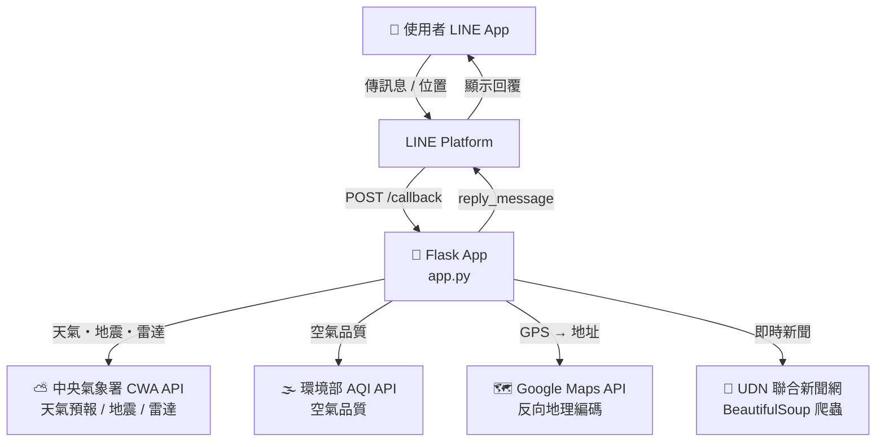

<div align="center">

# LineBot InfoGrabber

**整合天氣、新聞與即時地震示警的多功能 LINE 聊天機器人**

[](https://www.python.org/)
[](https://flask.palletsprojects.com/)
[](https://github.com/line/line-bot-sdk-python)
[](./LICENSE)

[](https://www.youtube.com/watch?v=kB-6KlzHT4E)

▲ 點擊圖片觀看實機操作影片

</div>

---

## ✨ 功能一覽

<table>
  <tr>
    <td align="center" width="25%">☀️<br><b>天氣預報</b><br><sub>傳送位置後即時回傳當地氣溫、濕度與未來三小時預報</sub></td>
    <td align="center" width="25%">🏥<br><b>健康提醒</b><br><sub>依天氣、溫度、降雨機率、AQI 自動生成穿著與活動建議</sub></td>
    <td align="center" width="25%">🔮<br><b>今日運勢</b><br><sub>選擇天氣狀況後隨機抽取專屬運勢語錄</sub></td>
    <td align="center" width="25%">🌍<br><b>地震資訊</b><br><sub>抓取氣象署最新有感 / 顯著地震報告並附示意圖</sub></td>
  </tr>
  <tr>
    <td align="center" width="25%">📡<br><b>雷達回波圖</b><br><sub>即時回傳氣象署雷達回波影像</sub></td>
    <td align="center" width="25%">📰<br><b>即時新聞</b><br><sub>快速選單選擇精選／財經／股市／娛樂／社會／科技</sub></td>
    <td align="center" width="25%">🌦️<br><b>氣象新聞</b><br><sub>抓取極端氣候相關最新報導</sub></td>
    <td align="center" width="25%"></td>
  </tr>
</table>

---

## 💬 指令對照表

| 使用者輸入 | Bot 回應 |
|-----------|---------|
| `天氣預報` | 提示傳送 GPS 位置，接收後回傳完整天氣 + 健康提醒 |
| 傳送位置訊息 | 自動觸發天氣查詢（同上） |
| `地震` | 最新地震文字報告 + 示意圖 |
| `雷達回波圖` / `雷達回波` | 即時雷達回波影像 |
| `即時新聞` | 快速選單選擇新聞類別 |
| `精選` / `財經` / `股市` / `娛樂` / `社會` / `科技` | 該類別最新 5 則新聞標題與連結 |
| `氣象新聞` | 極端氣候相關新聞 5 則 |
| `今日運勢` | 選擇天氣後隨機抽取運勢語錄 |

---

## 🔬 實作亮點

**1. 三資料源合併 → 一則天氣回覆**

每次天氣查詢同時呼叫三支 API，將結果合併後輸出：
- CWA 即時觀測站（O-A0001 / O-A0003）→ 氣溫、濕度、天氣描述
- CWA 縣市預報（F-D0047）→ 未來三小時天氣描述
- 環境部 AQI（aqx_p_432）→ 空氣品質指數

**2. 雙 API 地震比對取最新**

中央氣象署將有感地震（E-A0015）與顯著有感地震（E-A0016）分開存放，程式同時查兩支 API，比較 `OriginTime` 時間戳後回傳較新的一筆，確保使用者永遠看到最新地震資訊。

**3. 四維度健康提醒引擎**

`generate_health_advice()` 依據四個維度獨立判斷並組合建議：
- 天氣狀況（晴 / 陰 / 多雲 / 雨）
- 溫度區間（<10°C / 10–20°C / 20–30°C / >30°C）
- 降雨機率（<20% / 20–40% / >40%）
- AQI 區間（六段 0–300+）

**4. GPS 反向地理編碼 → 縣市對應**

收到使用者 GPS 座標後，透過 Google Maps Reverse Geocoding API 轉換為中文地址，再比對 22 縣市對照表取得對應的 CWA 預報資料集 ID（F-D0047-xxx），實現精準到行政區的天氣查詢。

**5. Webhook 簽章驗證**

使用 LINE Bot SDK 的 `WebhookHandler` 驗證每筆請求的 `X-Line-Signature`，非法請求一律回傳 400，防止偽造訊息。

---

## ⚡ Quick Start

> 三步驟讓 Bot 跑起來

**1. 安裝套件**
```bash
git clone https://github.com/Yuchen1222/LineBot-InfoGrabber.git
cd LineBot-InfoGrabber
pip install -r requirements.txt
```

**2. 設定環境變數**

建立 `.env` 檔（已被 `.gitignore` 排除，不會上傳）：
```env
CHANNEL_ACCESS_TOKEN=your_line_channel_access_token
CHANNEL_SECRET=your_line_channel_secret
GOOGLE_MAPS_API_KEY=your_google_maps_api_key
CWA_API_KEY=your_cwa_api_key
```

**3. 啟動伺服器 & 設定 Webhook**
```bash
python app.py          # 預設監聽 0.0.0.0:5000

# 另開終端，用 ngrok 產生公開 HTTPS URL（本地測試用）
ngrok http 5000
```

將 `https://xxxx.ngrok.io/callback` 填入 [LINE Developers Console](https://developers.line.biz/) → Messaging API → Webhook URL，即可開始使用。

---

## 🔑 環境變數

| 變數 | 說明 | 取得方式 |
|------|------|----------|
| `CHANNEL_ACCESS_TOKEN` | LINE Bot 頻道存取金鑰 | [LINE Developers Console](https://developers.line.biz/) |
| `CHANNEL_SECRET` | LINE Bot 頻道密鑰 | [LINE Developers Console](https://developers.line.biz/) |
| `GOOGLE_MAPS_API_KEY` | Google Maps Geocoding API 金鑰 | [Google Cloud Console](https://console.cloud.google.com/) |
| `CWA_API_KEY` | 中央氣象署 Open Data API 授權碼 | [opendata.cwa.gov.tw](https://opendata.cwa.gov.tw/) |

---

## 🏗️ 系統架構



---

## 🙋 FAQ

**Q1：Webhook 驗證失敗（400 Bad Request）怎麼辦？**
確認 `CHANNEL_SECRET` 環境變數是否正確設定，且 Webhook URL 末尾須為 `/callback`。

**Q2：傳送位置後顯示「找不到氣象資訊」？**
目前支援台灣本島及離島 22 縣市。請確認傳送的位置在支援範圍內，且地址含有正確的縣市名稱（程式已自動將「台」轉換為「臺」）。

**Q3：本地沒有公開 HTTPS URL 怎麼進行測試？**
使用 [ngrok](https://ngrok.com/)（免費方案）：執行 `ngrok http 5000` 後複製產生的 `https://` 網址填入 LINE Webhook 設定即可。

**Q4：新聞抓不到資料？**
UDN 新聞為網頁爬蟲，若聯合新聞網更改頁面結構，`story-list__text` 選擇器可能需要同步更新。

---

## 📦 Dependencies

```
Flask==3.0.0
requests==2.31.0
googlemaps==4.10.0
beautifulsoup4==4.12.2
line-bot-sdk==3.5.0
```

---

## 📄 License

本專案採用 [MIT License](./LICENSE) 授權。
